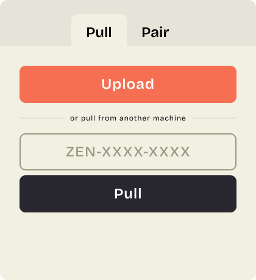
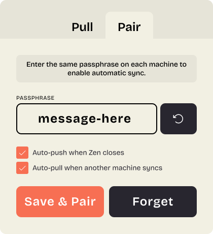

<div align="center">


# Zync

**Sync your Zen Browser profile between machines — no account, no server.**

[](https://github.com/jessewallace/zync/releases/latest)
[](LICENSE)
[](#installation)

</div>

---

[Zen Browser](https://www.zen-browser.app/) is a beautifully minimal, Firefox-based browser that stores workspaces, pinned tabs, and themes in its own proprietary data — none of which Firefox Sync covers. Zync fills that gap: one click pushes your profile to an encrypted, temporary link; paste the code on any other machine to pull it down. No accounts, no relay servers, nothing persisted longer than an hour.

---

## Screenshots

| Single Profile Push | Pair/Sync Profiles |
|:---:|:---:|
|  |  |

---

## How it works

```
┌─────────────────┐         ┌─────────────┐         ┌─────────────────┐
│   Machine A     │         │  Litterbox  │         │   Machine B     │
│                 │  push   │  (1h link)  │  pull   │                 │
│  [Push button]  │────────▶│  encrypted  │────────▶│  [Paste code]   │
│                 │         │    blob     │         │                 │
└─────────────────┘         └─────────────┘         └─────────────────┘
         │                                                    │
         │  ZEN-A3F9B2-ABC123                                 │
         └───────────────────────────────────────────────────▶│
```

1. **Push** — Zync bundles your profile files, encrypts them with AES-256-GCM, and uploads the blob to [Litterbox](https://litterbox.catbox.moe/) (expires in 1 hour).
2. **Share** — You receive a sync code like `ZEN-A3F9B2-ABC123`. The first segment is the decryption key; the second is the Litterbox file ID. Share it however you like.
3. **Pull** — Paste the code on any other machine. Zync downloads, decrypts, backs up your current profile, and writes the synced files — all in seconds.

Push and pull don't need to happen simultaneously. Any number of machines can pull the same code while the 1-hour window is open.

---

## What gets synced

| File | Contents |
|---|---|
| `places.sqlite` | Pinned tabs, workspaces, bookmarks |
| `zen-sessions.jsonlz4` | Workspace names, themes, tab assignments |
| `containers.json` | Workspace icons and colors |
| `zen-live-folders.jsonlz4` | Live folders |
| `prefs.js` | Browser preferences |
| `extensions.json` | Extensions list |
| `zen-themes.json` | Mods config (enabled list) |
| `chrome/zen-themes.css` | Compiled active mod styles |
| `zen-keyboard-shortcuts.json` | Keyboard shortcuts |

Passwords (`key4.db`, `logins.json`) and extension storage are excluded for safety. Zen must be **closed** before pushing or pulling — Zync detects this and blocks if it isn't.

---

## Auto-sync (Pair mode)

> **Experimental:** Pair mode is included in v0.1.0 but is experimental — not yet fully tested end-to-end. Use with caution and expect rough edges.

Pair mode lets two machines stay in sync without copying codes manually. Generate a shared passphrase on one machine, enter it on the other, and a background daemon pushes on a schedule and pulls whenever a new bundle is detected. Pair mode is coming in a future release — the groundwork (encryption, transport) is already in place.

---

## Installation

Download the latest release for your platform:

| Platform | Download |
|---|---|
| macOS (.dmg) | [Latest release →](https://github.com/jessewallace/zync/releases/latest) |
| Windows (.msi) | [Latest release →](https://github.com/jessewallace/zync/releases/latest) |
| Linux (.AppImage) | [Latest release →](https://github.com/jessewallace/zync/releases/latest) |

### Build from source

```bash
# Prerequisites: Rust (stable), Node 20+
git clone https://github.com/jessewallace/zync.git
cd zync
npm install
npm run build
# Installer appears in src-tauri/target/release/bundle/
```

---

## First-launch note

Zync is not yet notarized. On first launch, right-click the `.app` and choose **Open** — macOS will ask for confirmation once, then remember your choice.

On Windows, SmartScreen may warn about an unrecognized publisher — click **More info → Run anyway** to proceed.

---

## Security

- Encryption: **AES-256-GCM** (authenticated; tampering is detected)
- Key derivation: **PBKDF2-HMAC-SHA256**, 100,000 rounds, app-specific salt
- Key space: 2²⁴ (~16 million values) — larger than the 1-hour Litterbox expiry window an attacker would need to brute-force
- **No relay server** — Zync talks directly to Litterbox; nothing passes through our infrastructure
- **Backup before pull** — current profile files are copied to `{profile}/zync-backup-{timestamp}/` before any writes

---

## Roadmap

- [ ] WAL checkpoint before push (`PRAGMA wal_checkpoint(TRUNCATE)`)
- [ ] Same-machine round-trip test
- [ ] End-to-end integration tests
- [ ] Password sync (`key4.db` / `logins.json`) — opt-in only
- [ ] Selective workspace sync
- [ ] Pair mode (passphrase-based auto-sync daemon)
- [ ] macOS notarization

---

## Acknowledgments

Zync was inspired by [**arc2zen**](https://github.com/rafcabezas/arc2zen) by [@rafcabezas](https://github.com/rafcabezas) — a tool for migrating Arc Browser profiles to Zen Browser. His work surfaced just how much of Zen's data lives outside Firefox Sync, and made clear the gap that needed filling for anyone switching between machines.

---

## License

MIT — see [LICENSE](LICENSE).
