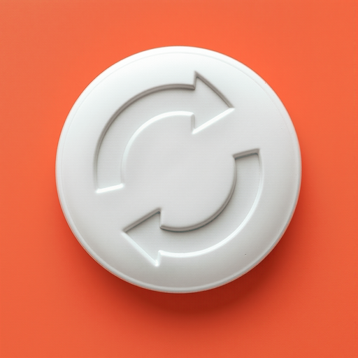
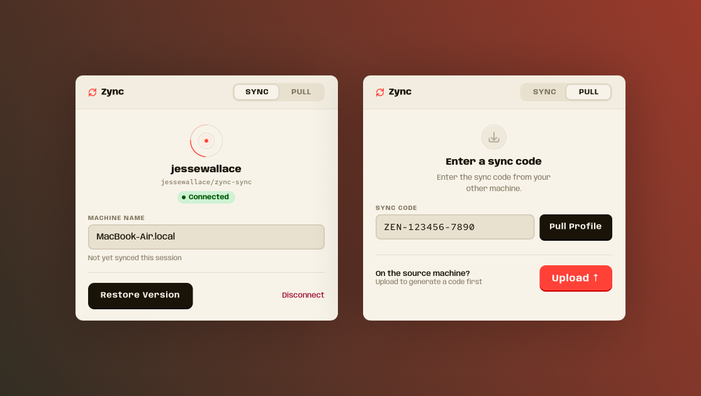

<div align="center">



# Zync

**Sync your Zen Browser profile between machines.**

[](https://github.com/jessewallace/zync/releases/latest)
[](LICENSE)
[](#installation)

</div>



---

[Zen Browser](https://www.zen-browser.app/) is a beautifully minimal, Firefox-based browser that stores workspaces, pinned tabs, and themes in its own proprietary data — none of which Firefox Sync covers. Zync fills that gap.

**Manual mode** — one click pushes your profile to an encrypted temporary link; paste the code on any other machine to pull it down. No accounts required.

**Automatic mode** — connect a GitHub account to enable background sync, persistent version history, and conflict-free merges when multiple machines are in use simultaneously.

---

## How it works

### Manual sync (no account required)

```
┌─────────────────┐         ┌─────────────┐         ┌─────────────────┐
│   Machine A     │         │  Litterbox  │         │   Machine B     │
│                 │  push   │  (1h link)  │  pull   │                 │
│  [Push button]  │────────▶│  encrypted  │────────▶│  [Paste code]   │
│                 │         │    blob     │         │                 │
└─────────────────┘         └─────────────┘         └─────────────────┘
         │                                                    │
         │  ZEN-A3F9B2-ABC123                                 │
         └───────────────────────────────────────────────────▶│
```

1. **Push** — Zync bundles your profile files, encrypts them with AES-256-GCM, and uploads the blob to [Litterbox](https://litterbox.catbox.moe/) (expires in 1 hour).
2. **Share** — You receive a sync code like `ZEN-A3F9B2-ABC123`. The first segment is the decryption key; the second is the Litterbox file ID.
3. **Pull** — Paste the code on any other machine. Zync downloads, decrypts, backs up your current profile, and writes the synced files.

Push and pull don't need to happen simultaneously. Any number of machines can pull the same code within the 1-hour window.

### Automatic sync (GitHub-backed)

Connect a GitHub account in the **Sync** tab. Zync creates a private `zync-sync` repository and stores encrypted profile snapshots as GitHub Release assets — no expiry, fully versioned.

When Zen closes on any connected machine, Zync automatically pushes the latest profile. Other machines detect the update via [ntfy.sh](https://ntfy.sh/) and pull when Zen is next closed. If two machines are active simultaneously, version-aware conflict resolution ensures the most recently synced profile wins without silently overwriting data.

---

## What gets synced

| File | Contents |
|---|---|
| `places.sqlite` | Pinned tabs, workspaces, bookmarks |
| `zen-sessions.jsonlz4` | Workspace names, themes, tab assignments |
| `containers.json` | Workspace icons and colors |
| `zen-live-folders.jsonlz4` | Live folders |
| `prefs.js` | Browser preferences |
| `extensions.json` | Extensions list |
| `zen-themes.json` | Mods config (enabled list) |
| `chrome/zen-themes.css` | Compiled active mod styles |
| `zen-keyboard-shortcuts.json` | Keyboard shortcuts |

Passwords (`key4.db`, `logins.json`) and extension storage are excluded. Zen must be **closed** before pushing or pulling — Zync detects this and blocks if it isn't.

---

## Version history

Automatic sync keeps up to 10 profile snapshots, each labeled with machine name and timestamp. You can restore any previous snapshot from the Sync tab — your current profile is saved as a new snapshot first, so you can always undo a restore.

---

## Installation

Download the latest release for your platform:

| Platform | Download |
|---|---|
| macOS (.dmg) | [Latest release →](https://github.com/jessewallace/zync/releases/latest) |
| Windows (.msi) | [Latest release →](https://github.com/jessewallace/zync/releases/latest) |
| Linux (.AppImage) | [Latest release →](https://github.com/jessewallace/zync/releases/latest) |

macOS releases are signed and notarized — no Gatekeeper warnings on first launch.

### Build from source

```bash
# Prerequisites: Rust (stable), Node 20+
git clone https://github.com/jessewallace/zync.git
cd zync
npm install
npm run build
# Installer appears in src-tauri/target/release/bundle/
```

---

## Security

**Manual sync**
- Encryption: **AES-256-GCM** (authenticated — tampering is detected)
- Key derivation: **PBKDF2-HMAC-SHA256**, 100,000 rounds
- The sync code embeds the decryption key — share it over a trusted channel
- Blobs expire from Litterbox after 1 hour; the attacker window is narrower than brute-force time

**Automatic sync**
- Profile blobs are encrypted before leaving your machine — GitHub never sees plaintext data
- Encryption key is auto-generated on first connect and stored in your OS keychain
- ntfy topic is derived from your GitHub user ID — never transmitted in plaintext
- No relay server — Zync talks directly to GitHub and ntfy.sh

**Both modes**
- Current profile files are backed up to `{profile}/zync-backup-{timestamp}/` before any pull

---

## Acknowledgments

Zync was inspired by [**arc2zen**](https://github.com/rafcabezas/arc2zen) by [@rafcabezas](https://github.com/rafcabezas) — a tool for migrating Arc Browser profiles to Zen Browser. His work surfaced just how much of Zen's data lives outside Firefox Sync, and made clear the gap that needed filling for anyone switching between machines.

---

## License

MIT — see [LICENSE](LICENSE).
